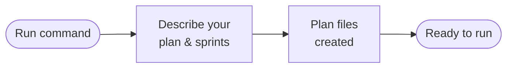

# planwise

**Your AI project manager that never forgets.**

planwise is a plugin for [Claude Code](https://docs.anthropic.com/en/docs/claude-code) that helps you plan, execute, review, and track your work across sessions. It keeps everything organized in simple markdown files so nothing gets lost between conversations.

## Table of contents

- [Initialize planwise](#step-1--initialize-planwise-in-your-project)
- [Start using planwise](#step-2--start-using-planwise)
  - [Create a plan](#create-a-plan)
  - [Review a plan](#review-a-plan-before-executing-it)
  - [Execute a plan](#execute-a-plan)
  - [Manage your backlog](#manage-your-backlog)
  - [List all plans](#list-all-your-plans)
  - [Lessons learned](#work-with-lessons-learned)
  - [Get help](#get-help)
- [Quick reference](#quick-reference)
- [How it works under the hood](#how-it-works-under-the-hood)
- [Updating planwise](#updating-planwise)
- [Uninstalling](#uninstalling)
- [Troubleshooting](#troubleshooting)

---

### The problem

Ever had Claude Code forget what you were working on? Started a new session and had to re-explain everything? Watched tasks pile up with no way to prioritize them?

**planwise fixes that.** It gives your projects a persistent memory — structured plans, scored backlogs, and lessons learned that survive across every session.

---

## Step 1 — Initialize planwise in your project

Navigate to the project you want to manage, open Claude Code there, and run:

```
/planwise init
```

Claude will ask you a few questions:

1. **Project name** — just type your project's name (e.g., `my-cool-app`)
2. **Planwise root directory** — where to store planwise files (default: `planwise/` in your project root — just press Enter to accept)
3. **Directory names** — for Plans, Backlog, and Lessons Learned (defaults are fine)

Once done, you'll see a new folder structure in your project:

```
your-project/
  planwise/
    config.yaml          <-- your project settings
    Plans/               <-- where session plans live
    Backlog/             <-- where tracked items go
    LessonsLearned/      <-- where insights are saved
  .claude/
    rules/
      planwise/          <-- 15 rules (or 18 if all pending references are adopted) that help Claude work with your plans
```

> **You only need to run `init` once per project.** After that, planwise remembers your setup.

#### How `init` works


---

## Step 2 — Start using planwise

Here's what you can do now. Each command starts with `/planwise` followed by a subcommand.

---

### Create a plan

```
/planwise plan my-new-feature
```

This walks you through creating a structured session plan. Claude will ask about:
- What abbreviation to use (like `APP` for app features, `BUG` for bug fixes)
- How many sprints you need
- What tasks go in each session

Your plan gets saved as organized markdown files you can review anytime.

> **What's a sprint?** A group of related work sessions. If your feature is small, one sprint with one session is enough. Bigger features might need multiple sprints.

**Scaffold from an existing Discovery phase:**

```
/planwise plan --scaffold APP
```

This takes a Discovery plan you've already written and automatically builds out all the sprints and tasks from it.

#### How `plan` works



---

### Review a plan before executing it

```
/planwise review
```

This sends your plan through a two-phase AI review:

1. **Structural review** — checks that files are named correctly, links aren't broken, and the plan hierarchy makes sense
2. **Content review** — checks task quality, token estimates, dependencies, and success criteria

You'll get a report with an **APPROVED** or **CHANGES REQUIRED** verdict.

> **Why review?** Catching problems in a plan is much cheaper than catching them mid-execution. Think of it like proofreading before you hit send.

#### How `review` works


---

### Execute a plan

```
/planwise run
```

This starts working through your planned tasks in order. You get two modes:

- **GUIDED mode** — Claude proposes each task and waits for your OK before doing it (recommended for your first time)
- **DELEGATED mode** — Claude works through tasks automatically using a task-runner agent

If you need to stop mid-session, don't worry — planwise saves a recovery file so you can pick up exactly where you left off.

#### How `run` works


---

### Manage your backlog

```
/planwise backlog
```

Opens an interactive view of all your tracked items, scored and prioritized. For each item, you choose a route:

| Route | When to use | What happens |
|-------|-------------|--------------|
| **A — Direct Fix** | Small bugs, quick changes | An AI agent fixes it right away |
| **B — Task List** | Medium scope work | Breaks it into steps and works through them |
| **C — New Plan** | Large features or overhauls | Creates a full plan for it |

**Filter your backlog:**

```
/planwise backlog --priority High
/planwise backlog --status IN_PROGRESS
/planwise backlog BUG-042
```

#### How `backlog` works


---

### List all your plans

```
/planwise list
```

Shows a table of every plan in your project with its status, sprint count, and when it was created.

#### How `list` works


---

### Work with lessons learned

**Search your lessons:**
```
/planwise lessons database migration
```

**Capture a lesson mid-session:**
```
/planwise lessons capture
```

**Promote a lesson to a formal rule:**
```
/planwise lessons promote LL-003
```

**Curate lessons — categorise new ones and track promotions:**
```
/planwise lessons curate
/planwise lessons curate --phase=categorize
/planwise lessons curate --phase=promote
```

Curate runs two phases against your lesson set. Phase 1 sorts uncategorised lessons into the domain buckets defined in `config.yaml` (Database, Application Code, Process, Tooling — customisable). Phase 2 finds lessons you've already promoted to rules or applied to code, verifies the destination artifact exists, and logs each one in the Rule Promotion Log inside your lessons index. Run `--phase=both` (the default) to do both at once, or scope to just one phase.

**Batch-draft promotion plans for a whole bucket:**
```
/planwise lessons promote-batch --category=A
/planwise lessons promote-batch LL-052,LL-053,LL-054
/planwise lessons promote-batch --all-documented
/planwise lessons promote-batch --category=A --dry-run
```

Where `/planwise lessons promote LL-003` promotes one lesson immediately, `promote-batch` plans the promotion of many lessons at once — grouping them by domain bucket and drafting backlog items (BBs) that describe the rules to be created, with the WRONG/CORRECT examples from each lesson inlined. Execution happens later via `/planwise backlog`. Add `--dry-run` to see the grouping plan without writing any files.

> **What are lessons learned?** When something goes wrong (or right!), planwise can capture that insight so you don't repeat mistakes or forget what worked.

> **Curate before you batch-promote.** `promote-batch` will refuse to run if any lessons in the master index aren't yet categorised. Run `/planwise lessons curate --phase=categorize` first to keep the bucketing file in sync.

#### How `lessons` works


---

### Get help

```
/planwise help
```

Shows all available commands at a glance and links to this full user guide.

#### How `help` works


---

## Quick reference

| Command | What it does |
|---------|-------------|
| `/planwise init` | Set up planwise in your project (once) |
| `/planwise plan [name]` | Create a new session plan |
| `/planwise plan --scaffold [abbrev]` | Build a plan from a Discovery phase |
| `/planwise review` | AI-review a plan before running it |
| `/planwise run` | Execute a planned session |
| `/planwise backlog` | Triage and work on backlog items |
| `/planwise list` | See all plans and their status |
| `/planwise lessons` | Search the lessons learned index |
| `/planwise lessons capture` | Capture a lesson mid-session |
| `/planwise lessons promote <id>` | Promote one lesson to a rule/skill/hook/agent |
| `/planwise lessons curate [--phase=X]` | Categorise new lessons and log promotions |
| `/planwise lessons promote-batch <scope>` | Plan promotion of many lessons as backlog items |
| `/planwise help` | Show available commands and link to user guide |

---

## How it works under the hood

planwise is built entirely on markdown files and Python scripts — no databases, no servers, no external services. Everything lives in your project folder and gets version-controlled with your code.

### Custom agents

planwise uses four specialized AI agents behind the scenes:

| Agent | What it does |
|-------|-------------|
| **structural-reviewer** | Validates plan file structure, naming, and cross-references |
| **plan-reviewer** | Deep content review — task specs, estimates, dependencies |
| **task-runner** | Executes individual tasks during plan runs |
| **fix-agent** | Applies targeted code fixes for small backlog items |

You don't need to interact with these directly — they're called automatically when you use `/planwise review`, `/planwise run`, and `/planwise backlog`.

### Configuration

After running `/planwise init`, your settings live in `planwise/config.yaml`. Here are the key things you might want to customize:

| Setting | What it controls | Default |
|---------|-----------------|---------|
| `project.name` | Your project name (used in headers) | Set during init |
| `abbreviations` | Category prefixes for plans (APP, BUG, etc.) | 4 defaults |
| `scoring` | How backlog items are scored and ranked | Sensible defaults |
| `build_commands.default` | Command to verify builds after changes | `echo '...'` |

### Plugin file structure

```
planwise/                           # Plugin root
  .claude-plugin/
    plugin.json                     # Plugin identity
    marketplace.json                # Marketplace catalog
  skills/planwise/SKILL.md          # The /planwise command router
  handlers/                         # 7 subcommand handlers (init, plan, review, run, backlog, list, lessons, help)
  agents/                           # 4 custom AI agents (auto-mirrored into project .claude/agents/ on init)
  references/                       # 18 knowledge base documents (10 baseline + 5 confirmed PPU additions + 3 pending user confirmation)
  templates/                        # 13 markdown templates
  seed/                             # Index file seeds for init
  scripts/                          # 7 Python backlog utilities
  examples/                         # Sample outputs
  config.yaml.template              # Config template
```

---

## Changelog

### 1.1.0 (planned PPU release)

**New reference files** (5 confirmed + 2 pending user confirmation):

- `references/ei-fidelity.md` — Execution Input fidelity (8 sections)
- `references/task-content-fidelity.md` — Task content fidelity §9.A + §9.B (21 rules)
- `references/schema-pin-requirement.md` — Schema Pin requirement for SQL-emitting tasks
- `references/discovery-and-exit-criteria.md` — Discovery scope rigor + cross-layer exit-criteria fidelity
- `references/scaffolding-hygiene.md` — Six binding rules for plan scaffolding (with parallel-scaffold deviation classes)
- `references/verification-gates.md` — IPC / protocol / codec round-trip evidence requirement *(pending user confirmation)*
- `references/verify-against-shipped-artifact.md` — Cross-sprint + cross-version symbol verification *(pending user confirmation)*

**New template:**

- `templates/sprint-signoff.md` — Sprint signoff template with EI exit-criteria verbatim quote + mechanical anchors + gate verdict + round-trip evidence

**Handler enhancements:**

- `handlers/plan.md` — Pre-Scaffold CONFIRM blocks at Discovery Step 1 + Scaffolding Step 1; multi-tier Discovery extraction (Tier 1 + Tier 2 + Tier 3); new `--scaffold-per-sprint` flag; Deferred / Out-of-Scope log per sprint; Auto-Init Fallback Config Gate; Auto-Mode tags at 14 critical + 2 convenience AskUserQuestion sites
- `handlers/review.md` — Namespaced agent spawns (`planwise:plan-reviewer`, `planwise:structural-reviewer`) at 7 spawn sites; ~12 new Error Pattern Catalog entries; Required References extended with 4 new conditional loads; Auto-Init Fallback Config Gate
- `handlers/run.md` — Namespaced `task-runner` spawns at 4 sites; Phase 4.3 user-action-gate check; Auto-Init Fallback Config Gate; Auto-Mode tags at 3 critical + 1 convenience sites
- `handlers/backlog.md` — Namespaced `fix-agent` spawn at 1 site; new Phase 7 FOLLOW-UP BLI CAPTURE (auto-files actionable recommendations from resolution Outputs); existing Phase 7 renumbered to Phase 8; Auto-Init Fallback Config Gate; Auto-Mode tags at 2 critical + 3 convenience sites
- `handlers/init.md` — Step 6 Rules table extended with 5 confirmed + 3 pending reference rows; NEW Step 6b agent mirroring; NEW `## Called As Subroutine` section documenting `--auto-from` subroutine contract; Step 10 banner updated to include Agents mirrored section
- `handlers/list.md` — Auto-Init Fallback Config Gate (no other substantive changes)
- `handlers/lessons.md` — Auto-Init Fallback Config Gate + Auto-Mode tags at 4 critical sites *(applied AFTER LCP-S03 merges)*

**Agent enhancements** (covered in separate consolidation parts):

- `agents/plan-reviewer.md` — Role checklists extended with ~50+ new BLOCKING / ERROR / WARNING checks (PLG-001..022 + Markuup + BB-028/031/032)
- `agents/structural-reviewer.md` — Folder-count check; Outputs/.gitkeep presence check; sequential-sprint prerequisite check

**Template enhancements:**

- `templates/task-file.md` — `Cross-Sprint Refs:` header field; Schema Pin subsection; Field Mapping subsection (MERGE/upsert); USED-Helper Enumeration subsection; Verification Commands section; `~?` placeholder prohibition constraint
- `templates/orchestration.md` — Scaffolding CONFIRM block placeholder; NEW DELEGATED Mandatory Triggers Reminder; updated Context Boundary callout (`> [!constraint]` form)

**Reference enhancements** (covered in separate consolidation parts):

- `references/agent-orchestration.md` — New §5 plugin-handler-spawn pitfall callout (PLG-017); §10 background-write hazard row; new §11 DELEGATED Dispatch Discipline (13 subsections); LSP-diagnostic-verification subsection; Large-File Read Tactics subsection
- `references/session-execution-protocol.md` — Discovery / Meta-Plan Status with user-action gates
- `references/session-plan-requirements.md` — Multi-tier Discovery extraction; EI bidirectional consistency; cross-sprint dependency mirroring; post-scaffold back-propagation; module split threshold; declarative follow-up block convention
- `references/callout-conventions.md` — New `> [!chain-halt]` callout type (PLG-007 S4)

**Auto-Init Fallback & Auto Mode Policy:**

- All 7 handlers receive Config Gate fallback subroutines (`plan`, `review`, `run`, `backlog`, `list`, `init`; `lessons` deferred to LCP merge)
- Per-handler AskUserQuestion call sites tagged with `<!-- AUTO-MODE: critical -->` or `<!-- AUTO-MODE: convenience -->` comments (24 critical + 13 convenience tags total)
- New `## 4b. Auto Mode Policy` section in `references/skill-authoring.md` documenting critical/convenience taxonomy + inference defaults
- New `install_agents()` function in `scripts/init_project.py` mirrors plugin agents into `.claude/agents/` (companion to PLG-017 namespacing)
- New `--auto-from {caller}` flag in `init_project.py` for subroutine-mode invocation

**Plugin file structure** (updated counts):

```
planwise/
  handlers/      # 8 subcommand handlers (init, plan, review, run, backlog, list, lessons, help)
  references/   # 18 knowledge base documents (10 baseline + 5 confirmed + 3 pending)
  templates/    # 13 markdown templates (12 baseline + sprint-signoff.md)
```

### 1.0.1 (current)

Baseline release. Existing 10 reference rules + 12 templates + 7 handlers + 4 agents.

---

## Updating planwise

To get the latest version, run:

```
/plugin marketplace update
```

Then reinstall:

```
/plugin install planwise@planwise-marketplace
```

---

## Uninstalling

To remove the plugin:

```
/plugin uninstall planwise
```

To remove the marketplace:

```
/plugin marketplace remove planwise-marketplace
```

> **Note:** Uninstalling the plugin does **not** delete your `planwise/` project folder or any of your plans, backlogs, or lessons. Your data is always safe.

---

## Troubleshooting

**"Command not found" when typing `/planwise`**
- Make sure you installed the plugin from the marketplace
- Run `/reload-plugins` or restart Claude Code to activate newly installed plugins

**"Config not found" when running a subcommand**
- Run `/planwise init` first — most commands need the project to be initialized

**Python scripts show errors**
- Check that Python 3.8+ is installed: `python --version`
- If you see YAML-related warnings, install PyYAML: `pip install pyyaml` (optional but silences warnings)

**Plans or backlog seem out of date**
- Run `/plugin marketplace update` then reinstall to get the latest plugin version

**Not sure which command to use?**
- Run `/planwise help` to see all available commands and a link to the full user guide

---

## License

MIT — Gabriel Gosselin
