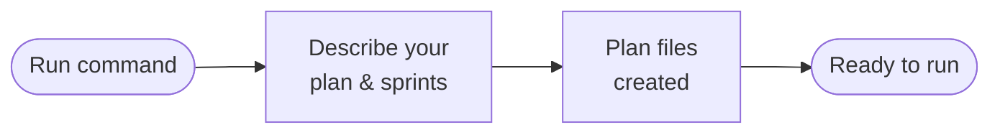
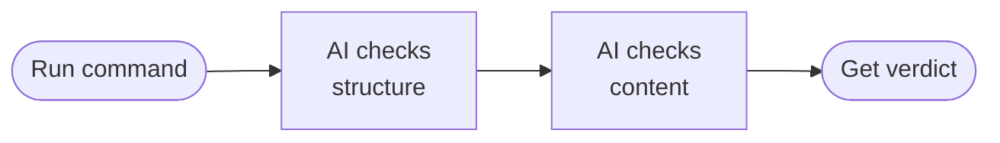
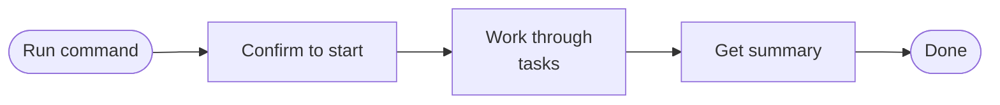
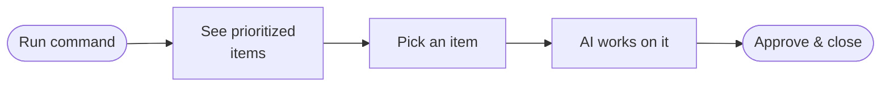
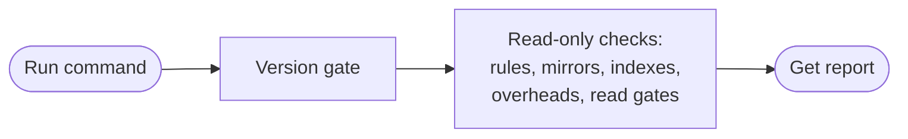
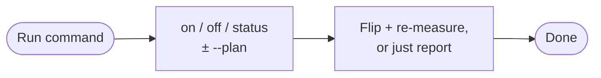
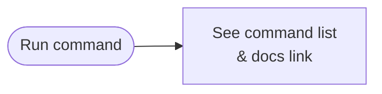
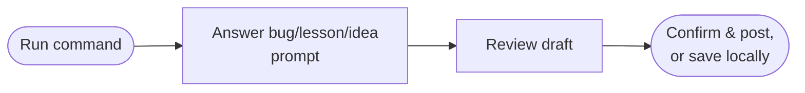

# planwise

**Your AI project manager that never forgets.**

planwise is a plugin for [Claude Code](https://docs.anthropic.com/en/docs/claude-code) that helps you plan, execute, review, and track your work across sessions. It keeps everything organized in simple markdown files so nothing gets lost between conversations.

## Table of contents

- [The problem](#the-problem)
- [1. `init` — set up planwise in your project](#1-planwise-init)
- [2. `plan` — create a plan](#2-planwise-plan)
- [3. `review` — review a plan before executing](#3-planwise-review)
- [4. `run` — execute a plan](#4-planwise-run)
- [5. `backlog` — triage and work your backlog](#5-planwise-backlog)
- [6. `list` — list all your plans](#6-planwise-list)
- [7. `lessons` — search and manage lessons learned](#7-planwise-lessons)
- [8. `doctor` — audit project health](#8-planwise-doctor)
- [9. `token-saver` — toggle Token Saver mode](#9-planwise-token-saver)
- [10. `upgrade` — update planwise](#10-planwise-upgrade)
- [11. `help` — show all commands](#11-planwise-help)
- [Quick reference](#quick-reference)
- [How it works under the hood](#how-it-works-under-the-hood)
- [Uninstalling](#uninstalling)
- [Troubleshooting](#troubleshooting)
- [License](#license)

---

## The problem

Ever had Claude Code forget what you were working on? Started a new session and had to re-explain everything? Watched tasks pile up with no way to prioritize them?

**planwise fixes that.** It gives your projects a persistent memory — structured plans, scored backlogs, and lessons learned that survive across every session.

Every command starts with `/planwise` followed by a subcommand. The sections below cover each one in order.

> **Not installed yet?** Add the marketplace and install the plugin first (see the repository's top-level README), then come back and start with `init`.

---

## 1. `/planwise init`

**Set up planwise in your project — run once per project.**

Navigate to the project you want to manage, open Claude Code there, and run:

```
/planwise init
```

Claude will ask you a few questions:

1. **Project name** — just type your project's name (e.g., `my-cool-app`)
2. **Planwise root directory** — where to store planwise files (default: `planwise/` in your project root — just press Enter to accept)
3. **Directory names** — for Plans, Backlog, and Lessons Learned (defaults are fine)

Once done, you'll see a new folder structure in your project:

```
your-project/
  planwise/
    config.yaml          <-- your project settings
    Plans/               <-- where session plans live
    Backlog/             <-- where tracked items go
    LessonsLearned/      <-- where insights are saved
  .claude/
    rules/
      planwise/          <-- 4 path-scoped rules installed (the rest load on demand from the plugin)
```

> **You only need to run `init` once per project.** After that, planwise remembers your setup. `init` also offers to enable [Token Saver mode](#9-planwise-token-saver).

#### How `init` works


---

## 2. `/planwise plan`

**Create a structured session plan.**

```
/planwise plan my-new-feature
```

This walks you through creating a structured session plan. Claude will ask about:
- What abbreviation to use (like `APP` for app features, `BUG` for bug fixes)
- How many sprints you need
- What tasks go in each session

Your plan gets saved as organized markdown files you can review anytime.

> **What's a sprint?** A group of related work sessions. If your feature is small, one sprint with one session is enough. Bigger features might need multiple sprints.

**Scaffold from an existing Discovery phase:**

```
/planwise plan --scaffold APP
```

This takes a Discovery plan you've already written and automatically builds out all the sprints and tasks from it.

#### How `plan` works



---

## 3. `/planwise review`

**Review a plan before you execute it.**

```
/planwise review
```

This sends your plan through a two-phase AI review:

1. **Structural review** — checks that files are named correctly, links aren't broken, and the plan hierarchy makes sense
2. **Content review** — checks task quality, token estimates, dependencies, and success criteria

You'll get a report with an **APPROVED** or **CHANGES REQUIRED** verdict.

> **Why review?** Catching problems in a plan is much cheaper than catching them mid-execution. Think of it like proofreading before you hit send.

#### How `review` works



---

## 4. `/planwise run`

**Execute a planned session.**

```
/planwise run
```

This starts working through your planned tasks in order. You get two modes:

- **GUIDED mode** — Claude proposes each task and waits for your OK before doing it (recommended for your first time)
- **DELEGATED mode** — Claude works through tasks automatically using a task-runner agent

If you need to stop mid-session, don't worry — planwise saves a recovery file so you can pick up exactly where you left off.

#### How `run` works



---

## 5. `/planwise backlog`

**Triage and work your tracked items.**

```
/planwise backlog
```

Opens an interactive view of all your tracked items, scored and prioritized. For each item, you choose a route:

| Route | When to use | What happens |
|-------|-------------|--------------|
| **A — Direct Fix** | Small bugs, quick changes | An AI agent fixes it right away |
| **B — Task List** | Medium scope work | Breaks it into steps and works through them |
| **C — New Plan** | Large features or overhauls | Creates a full plan for it |

**Filter your backlog:**

```
/planwise backlog --priority High
/planwise backlog --status IN_PROGRESS
/planwise backlog BUG-042
```

**Archival stays in sync.** Closing an item moves its file to `Archive/` and repoints the index link in the same step, and re-runs are safe. If an item was closed by hand and its file left stranded, `backlog` detects the drift on open and offers to reconcile it — nothing is moved without your consent (`--no-check` skips the detect pass for fast triage).

#### How `backlog` works



---

## 6. `/planwise list`

**List all your plans and their status.**

```
/planwise list
```

Shows a table of every plan in your project with its status, sprint count, and when it was created.

`list` also cross-checks every index row against its plan's actual Master Plan status and flags any drift before the table, offering to reconcile the index on the spot — nothing is written without your consent (`--no-check` skips the check).

#### How `list` works


---

## 7. `/planwise lessons`

**Search and manage lessons learned.**

**Search your lessons:**
```
/planwise lessons database migration
```

**Capture a lesson mid-session:**
```
/planwise lessons capture
```

**Promote a lesson to a formal rule:**
```
/planwise lessons promote LL-003
```

**Curate lessons — categorise new ones and track promotions:**
```
/planwise lessons curate
/planwise lessons curate --phase=categorize
/planwise lessons curate --phase=promote
```

Curate runs two phases against your lesson set. Phase 1 sorts uncategorised lessons into the domain buckets defined in `config.yaml` (Database, Application Code, Process, Tooling — customisable), tags each lesson's promotion target from its own structure (a fenced code block reads as `code`, a MUST/NEVER callout reads as `rule`), and flags a lesson that spans several target types as a split candidate. Phase 2 lands `promoted` lessons whose owning backlog item has shipped — verifying the destination artifact exists and logging each one in the Rule Promotion Log inside your lessons index. Run `--phase=both` (the default) to do both at once, or scope to just one phase.

**Batch-draft promotion plans for a whole bucket:**
```
/planwise lessons promote-batch --category=A
/planwise lessons promote-batch LL-001,LL-002,LL-003
/planwise lessons promote-batch --all-documented
/planwise lessons promote-batch --category=A --dry-run
```

Where single-lesson promote acts immediately, `promote-batch` plans the promotion of many lessons at once — grouping them by domain bucket and drafting backlog items (BBs) that describe the rules to be created, with the WRONG/CORRECT examples from each lesson inlined. Execution happens later via `/planwise backlog`. Add `--dry-run` to see the grouping plan without writing any files.

**The lesson lifecycle.** Lessons graduate through four statuses: `documented → promoted → applied | rule`. When `promote-batch` fully captures a lesson into actionable backlog item(s), the lesson flips to the stable `promoted` status and moves to the archive right away — the backlog item becomes the live owner of the work (archived ≠ landed). When that item ships, `curate --phase=promote` lands the lesson as `applied` or `rule`. A lesson promoted one at a time skips the middle state and lands directly.

> **What are lessons learned?** When something goes wrong (or right!), planwise can capture that insight so you don't repeat mistakes or forget what worked.

> **Curate before you batch-promote.** `promote-batch` will refuse to run if any lessons in the master index aren't yet categorised. Run `/planwise lessons curate --phase=categorize` first to keep the bucketing file in sync.

#### How `lessons` works


---

## 8. `/planwise doctor`

**Audit your project's planwise health — read-only unless you explicitly opt in to cleanup.**

```
/planwise doctor
```

`doctor` opens with a version-state gate, then runs a set of read-only checks and prints a report. A bare `doctor` never writes a file and exits cleanly even when it flags something:

- **Version-state gate** — before any diagnostics, verifies the project is initialized and the pinned `plugin_version` matches the installed plugin; when it doesn't, recommends `/planwise init` or `/planwise upgrade` and stops there.
- **Rule scope** — lists any `.claude/rules/**` still scoped to plan/backlog/lessons paths. These inject into every plan-brief read and can overflow a 200K-window task-runner, so `doctor` flags them with their size.
- **Token Saver overhead staleness** — reports the stored `/context`-measured overheads and flags them stale after a plugin upgrade or a change in your agent/skill count.
- **Read-gate scan** — checks your active plan's files against the Read-tool limits (256 KiB byte cap, ~25K-token page cap) and flags any that can't be read in one pass.
- **Read-limit drift** — flags the fixed read constants if your CLI build has moved past the version they were measured on.
- **Stale de-scoped rule sweep** — finds rule copies left behind in `.claude/rules/planwise/` by older versions; those rules are now loaded on demand from the plugin instead.
- **Installed rule divergence lint** — classifies every still-installed rule against its shipped counterpart: a stale copy of an older shipped version (run [`/planwise upgrade`](#10-planwise-upgrade) — it refreshes it safely), a genuine customization (re-home it — never delete), or not analyzable (diff it manually).
- **Orphaned agent mirror sweep** — flags agent copies under `.claude/agents/` left behind by older versions that mirrored agents into the project; agents now run directly from the plugin, so copies you never edited are safe to remove.
- **Index drift audits** — cross-checks the plans index against each Master Plan's actual status, and the backlog index against archival state.

**Opt-in cleanup:** `/planwise doctor --prune-stale` is the one doctor invocation that writes. It removes only what the stale-rule sweep and the mirror sweep flagged as provably removable — every deleted file is first backed up next to a `PRUNED.md` audit log under `{planwise_root}/upgrade-backups/`, and anything carrying content of your own is always preserved in place.

Run it any time for a quick health check — especially right after a [`/planwise upgrade`](#10-planwise-upgrade).

#### How `doctor` works



---

## 9. `/planwise token-saver`

**Toggle Token Saver mode and manage per-plan overrides.**

Token Saver is an optional budget mode that keeps each task session lean — under a ~150K carrying-cost target — instead of letting context balloon across turns. When it's on, planwise:

- **Sizes tasks by carrying cost**, warning (or splitting) a task whose Required Context would push a runner past its measured budget.
- **Flags files that are too large to read in one pass** — a file at or over the Read tool's 256 KiB byte cap or ~25K-token page cap is marked for paged reads (`offset`/`limit`/Grep) or refactor. (This is a separate gate from the budget: a file can fit the budget yet still be unreadable in a single Read.)
- **Routes a genuinely oversized, indivisible file to the 1M (Opus) window** via a `1M-exception` marker — but only for a *cost*-reason overflow. A file that is too large to *read* is never fixed by the bigger window (Opus hits the page cap sooner); it is paged or refactored instead.

**Toggle it anytime** — you don't have to wait for an init or upgrade:

```
/planwise token-saver on        # enable + re-measure overheads
/planwise token-saver off        # disable (verified no-op — no scan, no ladder)
/planwise token-saver status     # report the default, when it was measured, and staleness
```

- **`on` re-calibrates.** Enabling re-captures a live `/context` report so the measured overheads reflect your current install — the same calibration `/planwise upgrade` runs. (If the capture can't run, it falls back to conservative defaults and tells you to re-run from an interactive session.)
- **`off` is a verified no-op.** Disabling turns the budget engine off cleanly — no read-gate scan, no task-budget ladder, no exceptions — and leaves the measured overheads in place for a future re-enable.
- **`status` is read-only.** It prints the project default, the date it was measured, and whether that measurement is stale (after a plugin upgrade or an agent/skill count change), recommending a one-command re-measure.

**Override it for a single plan.** `context.token_saver` in `config.yaml` is the project-wide default. A single plan can opt in or out independently via a `Token Saver:` field in its Master Plan — without changing `config.yaml` and without recalibrating (the measured overheads are project-level, since there is one `/context` calibration per install):

```
/planwise token-saver on --plan MyFeature        # override one plan ON
/planwise token-saver off --plan MyFeature        # override one plan OFF
/planwise token-saver --plan MyFeature inherit    # drop the override → re-inherit the default
/planwise token-saver status --plan MyFeature     # show the plan's effective value
```

**Thresholds are measured, not guessed.** The budget is keyed to your install's real footprint: `/planwise init` and `/planwise upgrade` capture a live `/context` report and write the measured overheads into `config.yaml`, and the per-task ceilings are derived from those numbers. Toggling only flips enforcement on or off; the budget numbers always come from a real measurement. Run [`/planwise doctor`](#8-planwise-doctor) any time for a read-only audit of those numbers.

#### How `token-saver` works



---

## 10. `/planwise upgrade`

**Refresh installed rules and config after a plugin update.**

When a new plugin version is published, upgrading happens in two stages:

1. **Refresh the plugin source**

   ```
   /plugin marketplace update
   /plugin install planwise@planwise-marketplace
   ```

   This updates the plugin's handlers, references, templates, and scripts to the latest version. Files Claude reads directly from the plugin directory are now current.

2. **Propagate updates into your project's `.claude/` directory**

   ```
   /planwise upgrade
   ```

   `/plugin install` does not refresh the rules in `.claude/rules/planwise/` — those were installed during `/planwise init` and are skip-if-exists thereafter. (Agents need no propagation step at all: they run directly from the plugin, invoked as `planwise:<name>`, so Stage 1 alone updates them.) `/planwise upgrade`:

   - Bumps the pinned `plugin_version:` in your `config.yaml`
   - Adds any new top-level config keys (the additive merge previously available via `--migrate`), including the `upgrade:` block described below
   - Backfills missing lessons scaffolding — seeds the lessons index and the categorization file that gates `lessons curate` / `promote-batch` when either is absent (idempotent; an existing file, customised or not, is preserved verbatim)
   - Refreshes installed rules whose local body still matches the previously-shipped body
   - **Auto-adopts stale copies:** a diverged file whose content is a clean structural subset of the newer shipped version (an old copy you never edited, that the plugin has since grown) is refreshed in place — rules keep your `paths:` line. Before any overwrite or removal, the pre-change file is copied under `{planwise_root}/upgrade-backups/<from>-to-<to>/` (with a `DISPOSITIONS.md` log), so every automatic disposition is recoverable even without git
   - **Hands off customisations per `upgrade.customization_handoff`:** under `report+relocate` (the shipped default), a file that carries content of your own is first transferred verbatim — with a provenance header — to `{planwise_root}/upgrade-transfers/<from>-to-<to>/` as a dormant preservation document (outside `.claude/rules/`, never loaded as a rule), the transfer is verified by reading it back, and only then is the shipped body adopted in place. Under `report` / `report+issue` — or whenever a transfer, backup, or adoption write fails, or the verdict isn't analyzable — the file is preserved in place and a `.new` sidecar is written under `{planwise_root}/upgrade-conflicts/<from>-to-<to>/` for manual merge. Either way, your content is never destroyed
   - **Retires de-scoped rules:** author-time rules that are now loaded on demand from the plugin's `references/` are removed from `.claude/rules/planwise/` when your installed copy is untouched **or is a high-confidence stale subset** of the grown shipped reference (backed up first). Under `report+relocate`, a copy with content of your own is transferred to `upgrade-transfers/` before removal; under the conservative handoff modes it is **preserved byte-for-byte with an action-required notice**. A copy whose only edit is its `paths:` line is preserved while `upgrade.descope_preserve_paths_edits` is `true` (the default) — re-home it as a project-local rule, re-scope its `paths:`, or upstream the change.
   - **Re-calibrates Token Saver** overheads (the same `/context` capture `token-saver on` runs) so the budget tracks your current install.
   - **Over-scope advisory:** after upgrading, the script lists any `.claude/rules/**` still scoped to plan/backlog/lessons paths. Run [`/planwise doctor`](#8-planwise-doctor) any time for the full read-only report.

   See `handlers/upgrade.md` for the full workflow.

> Running `/planwise init` after a plugin update detects the pinned-version drift and surfaces a SKIPPED row pointing at this command, so the prompt is reachable even if you forget the recipe.

---

## 11. `/planwise help`

**Show all available commands at a glance.**

```
/planwise help
```

Shows all available commands and links to this full user guide — served inline by the `/planwise` skill router rather than a separate handler file.

#### How `help` works



---

## 12. `/planwise feedback`

**Report a planwise bug, lesson, or idea upstream.**

```
/planwise feedback
```

Walks you through a short prompt — bug, lesson, or idea — and drafts a submission from what you type. Only your answers to the prompt go into the draft; file contents, repo paths, and config values are never included.

**Opt-in, off by default.** Posting upstream requires `feedback.enabled: true` in your `config.yaml` AND an interactive confirmation that shows you the exact body before anything is sent — nothing goes out without both. In Auto Mode, `feedback` never posts: it always saves the draft to disk and prints the file path instead.

**Privacy.** The submitted body never contains your file contents, repo paths, or config values — only what you wrote in the prompt. If `gh` isn't installed, isn't authenticated, or you decline the post, your draft is preserved locally and the issues URL is printed so you can file it by hand.

#### How `feedback` works



---

## Quick reference

| Command | What it does |
|---------|-------------|
| `/planwise init` | Set up planwise in your project (once) |
| `/planwise plan [name]` | Create a new session plan |
| `/planwise plan --scaffold [abbrev]` | Build a plan from a Discovery phase |
| `/planwise review` | AI-review a plan before running it |
| `/planwise run` | Execute a planned session |
| `/planwise backlog` | Triage and work on backlog items |
| `/planwise list` | See all plans and their status |
| `/planwise lessons` | Search the lessons learned index |
| `/planwise lessons capture` | Capture a lesson mid-session |
| `/planwise lessons promote <id>` | Promote one lesson to a rule/skill/hook/agent |
| `/planwise lessons curate [--phase=X]` | Categorise new lessons and log promotions |
| `/planwise lessons promote-batch <scope>` | Plan promotion of many lessons as backlog items |
| `/planwise doctor` | Audit install health — version gate, stale/diverged rules, orphaned mirrors, index drift, Token Saver staleness (`--prune-stale` to clean up) |
| `/planwise token-saver on\|off\|status` | Toggle Token Saver mode anytime (`--plan` to override one plan) |
| `/planwise upgrade` | Refresh installed rules + config after a plugin update |
| `/planwise help` | Show available commands and link to user guide |
| `/planwise feedback` | Report a planwise bug, lesson, or idea upstream |

---

## How it works under the hood

planwise is built entirely on markdown files and Python scripts — no databases, no servers, no external services. Everything lives in your project folder and gets version-controlled with your code.

### Custom agents

planwise uses five specialized AI agents behind the scenes:

| Agent | What it does |
|-------|-------------|
| **structural-reviewer** | Validates plan file structure, naming, and cross-references |
| **plan-reviewer** | Deep content review — task specs, estimates, dependencies |
| **task-runner** | Executes individual tasks during plan runs |
| **fix-agent** | Applies targeted code fixes for small backlog items |
| **rule-comparator** | Classifies a diverged installed rule against the shipped version during `/planwise upgrade` — stale copy vs. genuine customization |

You don't need to interact with these directly — they're called automatically when you use `/planwise review`, `/planwise run`, `/planwise backlog`, and `/planwise upgrade`. Agents run straight from the plugin (invoked as `planwise:<name>`); nothing is copied into your project.

### Configuration

After running `/planwise init`, your settings live in `planwise/config.yaml`. Here are the key things you might want to customize:

| Setting | What it controls | Default |
|---------|-----------------|---------|
| `project.name` | Your project name (used in headers) | Set during init |
| `abbreviations` | Category prefixes for plans (APP, BUG, etc.) | 4 defaults |
| `scoring` | How backlog items are scored and ranked | Sensible defaults |
| `build_commands.default` | Command to verify builds after changes | `echo '...'` |
| `context.token_saver` | Token Saver mode default (see [§9](#9-planwise-token-saver)) | `false` |
| `upgrade.customization_handoff` | How upgrade hands off files you've customised (see [§10](#10-planwise-upgrade)) | `report+relocate` |

### Plugin file structure

```
planwise/                           # Plugin root
  .claude-plugin/
    plugin.json                     # Plugin identity
    marketplace.json                # Marketplace catalog
  skills/planwise/SKILL.md          # The /planwise command router
  handlers/                         # 10 subcommand handlers across 13 files (init, plan, review, run, upgrade, doctor, token-saver, backlog, list, lessons; help is served inline by the skill router)
  agents/                           # 5 custom AI agents (invoked as planwise:<name>; not mirrored into the project)
  references/                       # Knowledge base documents (4 installed as path-scoped rules + the rest handler-loaded in-place / consumed inline, incl. the de-scoped session/scaffolding/orchestration/conventions/verification rules)
  templates/                        # Markdown templates
  seed/                             # Index file seeds for init
  scripts/                          # Python scripts (backlog + index-reconcile utilities, init_project.py, token_saver.py, structural_compare.py)
  examples/                         # Sample outputs
  config.yaml.template              # Config template
```

---

## Uninstalling

To remove the plugin:

```
/plugin uninstall planwise
```

To remove the marketplace:

```
/plugin marketplace remove planwise-marketplace
```

> **Note:** Uninstalling the plugin does **not** delete your `planwise/` project folder or any of your plans, backlogs, or lessons. Your data is always safe.

---

## Troubleshooting

**"Command not found" when typing `/planwise`**
- Make sure you installed the plugin from the marketplace
- Run `/reload-plugins` or restart Claude Code to activate newly installed plugins

**"Config not found" when running a subcommand**
- Run `/planwise init` first — most commands need the project to be initialized

**Python scripts show errors**
- Check that Python 3.8+ is installed: `python --version`
- If you see YAML-related warnings, install PyYAML: `pip install pyyaml` (optional but silences warnings)

**Plans or backlog seem out of date after a plugin update**
- Run the two-step upgrade recipe: `/plugin marketplace update` + `/plugin install planwise@planwise-marketplace`, then `/planwise upgrade` to propagate refreshed rules into your project

**Token Saver always shows "uncalibrated" on Windows**
- The `/context` capture needs a real console; run `/planwise token-saver on` from an interactive Claude Code session so the measured overheads can be captured

**Not sure which command to use?**
- Run `/planwise help` to see all available commands and a link to the full user guide

**Something in planwise itself looks broken, or you have an idea**
- Run `/planwise feedback`, or open an issue directly at https://github.com/gabgoss/planwise/issues

---

## License

MIT — Gabriel Gosselin
